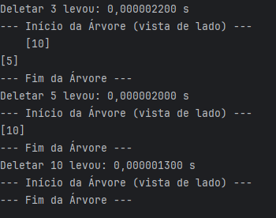
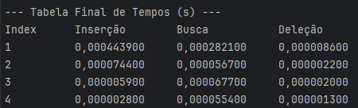

1) Como compilar o programa: É necessário ter o java 21 instalado na sua máquina e fazer o clone do repositório. Para compilar, vá para o local do diretório e digite javac -d bin (Get-ChildItem -Recurse -Filter *.java).FullName
2) Não foram utilizadas dependências externas. Todas as classes utilizadas no programa são padrões do Java.
3) As operações que foram implementadas são: impressão, inserção, remoção e busca.
4) Para executar o programa, abra o terminal e digite java -cp bin MainApplication seguido do tipo de árvore que deseja construir: avl ou rb. Por exemplo, para criar uma árvore AVL, digite:

java -cp bin MainApplication avl

O programa exibirá a impressão da árvore conforme os métodos são executados, mostrando visualmente como a estrutura se modifica após cada operação. Ao final, será exibida uma tabela com o tempo de execução de cada método, permitindo acompanhar a eficiência das operações.

